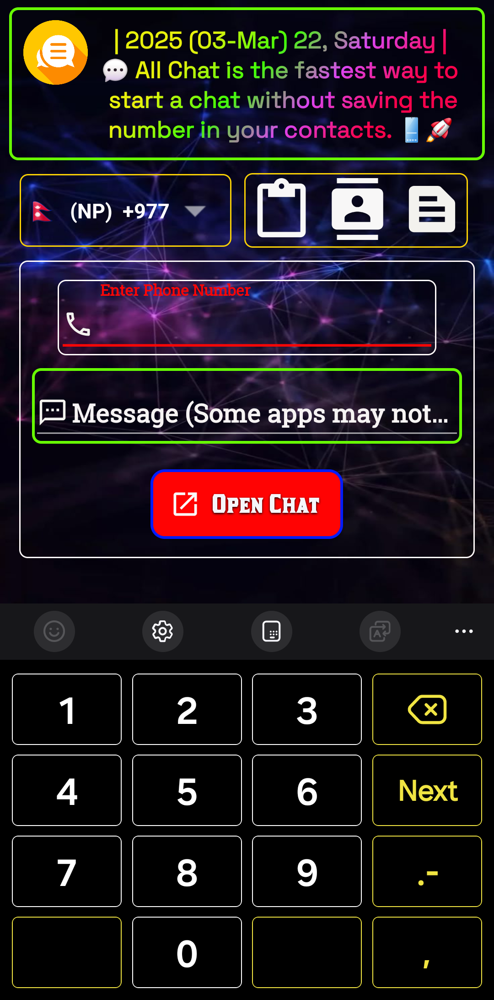
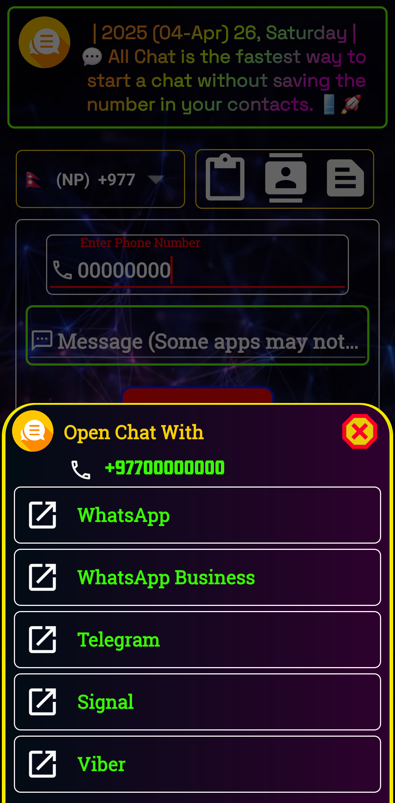
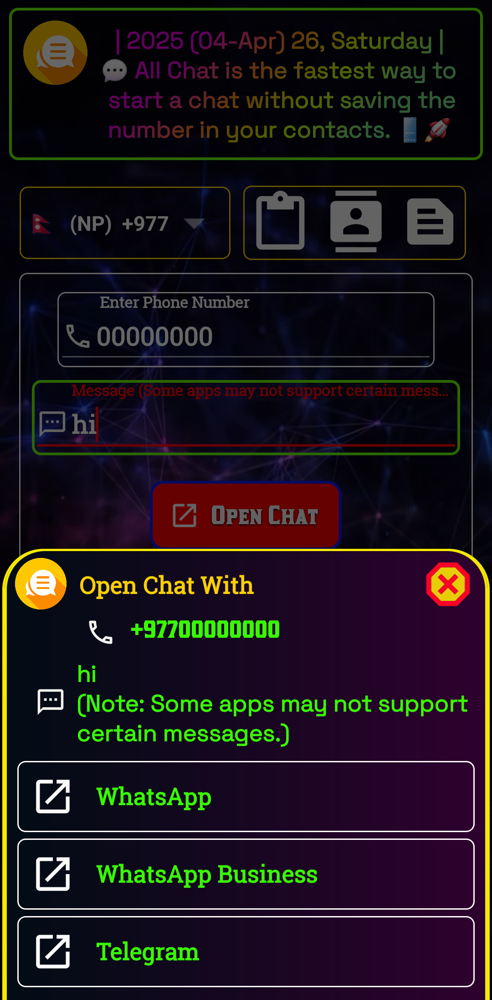
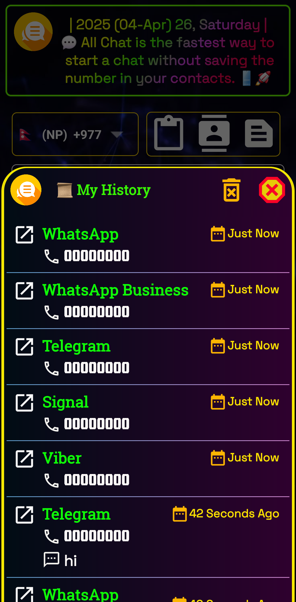
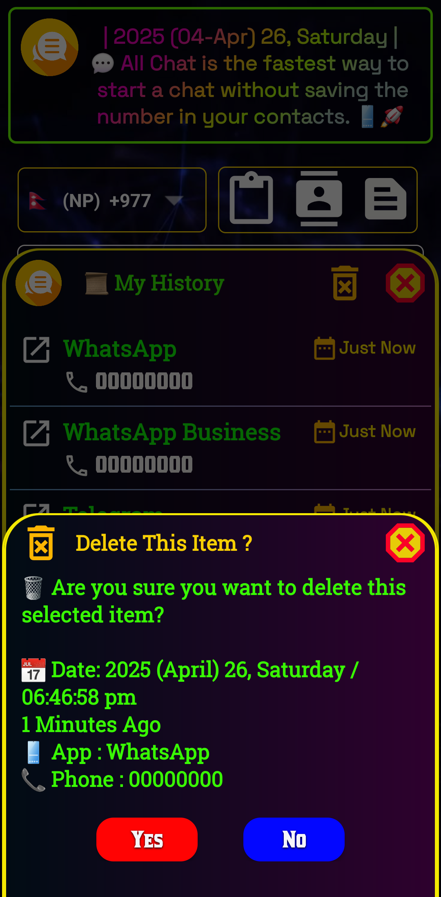
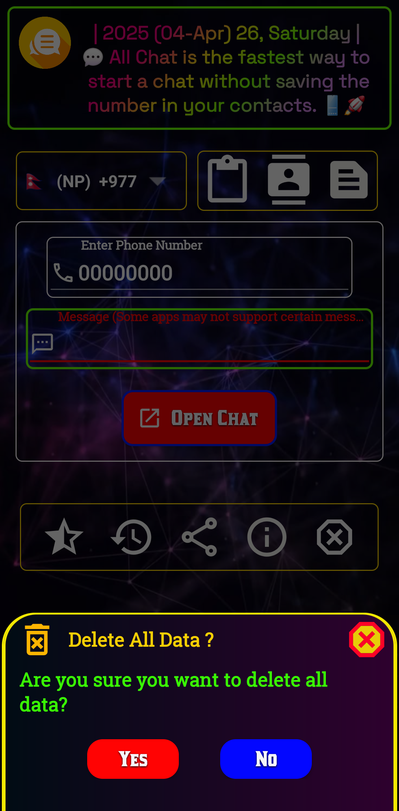
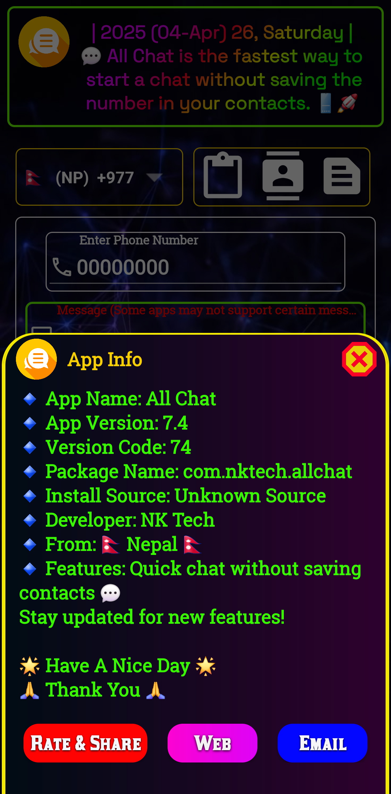
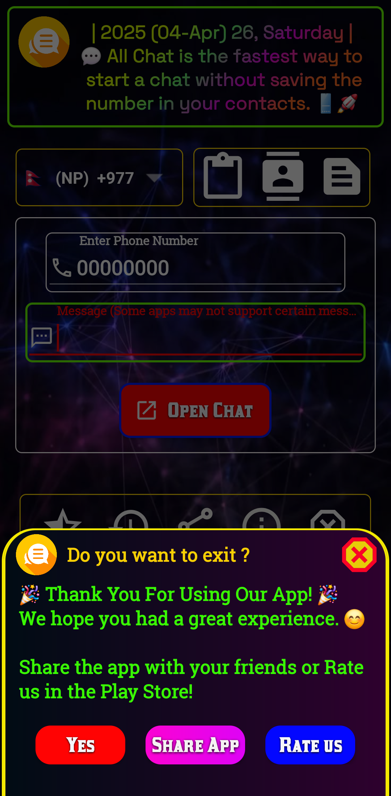

  

# 💬 DirectChat – All Chat Open

Open chats instantly without saving phone numbers.

DirectChat is a simple, fast, and privacy-friendly Android application that lets you start conversations with phone numbers on your favorite messaging apps without adding them to your contacts.

---

## 📱 Features

* 💬 Open chats without saving contacts
* ⚡ Fast and lightweight
* 🔢 Enter or paste any phone number
* 📋 One-tap paste from clipboard
* 🌍 International country code support
* 📱 Clean and user-friendly interface
* 🔒 No login required
* 🚫 No contact permission needed
* 📤 Share numbers directly to the app
* 🛡️ Secure and privacy-focused

### 💚 Supported Apps

* 🟢 WhatsApp
* 💼 WhatsApp Business
* ✈️ Telegram
* 🔒 Signal
* 📞 Viber

---

## 📥 Download on Google Play

---

## 📸 Screenshots

<table>
  <tr>
    <td></td>
    <td></td>
    <td></td>
    <td></td>
  </tr>
  <tr>
    <td></td>
    <td></td>
    <td></td>
    <td></td>
  </tr>
</table>

---

## 📧 Contact

**Developer:** NK Tech (NP)

📧 Email: [ournktech@gmail.com](mailto:ournktech@gmail.com)

🌐 Website: https://ournktech.com/

---

## ⭐ Support

If you find DirectChat useful, please consider giving this repository a ⭐ on GitHub.

---

## 📄 License

This project is licensed under the MIT License.
